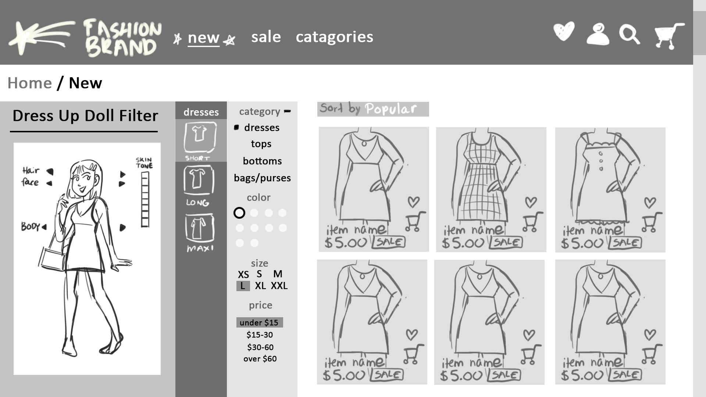

# Project Title

YouDress

## Overview

YouDress is a virtual fashion retail storefront that employs a 'dress up doll' feature so users can visually plan an outfit to purchase. Whether they're considering a new piece to go with their exisiting collection or buying a whole new outfit, their customized doll will alow them to unleash their creativity and consider various styling options. This is a fun way for users to filter out products to find and purchase new wardrobe pieces.

### Problem

When purchasing clothing online, the only way to visually conceptualize your future outfit is to consider the model in product photos and the list of clothing items in your shopping cart. Rather than having to put the outfit together once the user's pieces arrive in the mail, YouDress encourages the user to conceptualize how these pieces would fit together in a new or existing wardrobe before ordering.
YouDress attempts to bring the physical "try-on" experience found in a physical retailer, to a digital storefront, albeit in a more stylized and abstract way.

### User Profile

-Online Shoppers (Women's Fashion - Young Adult Focus)
-Women ages 25-34 (highest preference for online shopping, potential nostalgia for early internet era dress up games)
-Women ages 18-25 (likely to be mobile users)
-Middle to upper class
-Likely use either Snapchat/Instagram/Twitter/Pinterest for fashion information

### Features

List the functionality that your app will include. These can be written as user stories or descriptions with related details. Do not describe _how_ these features are implemented, only _what_ needs to be implemented.

-Dress up doll
Various Layered outfit item SVG's on a dress up doll model that are put on/swapped/re-coloured/taken off by user inputs
Dress up doll should persist from page to page and outfit information stored so user does not lose their outfit by navigating the website

-products filter
-products display
-page navigation
-pages (filter products/ saved products/ shopping cart purchase)
-shopping cart click
-favourites click

## Implementation

### Tech Stack

- React
- MySQL
- MySQL Workbench
- Express
- Client libraries:
  - react
  - react-router
  - axios
- Server libraries:
  - knex
  - express
  - bcrypt for password hashing
