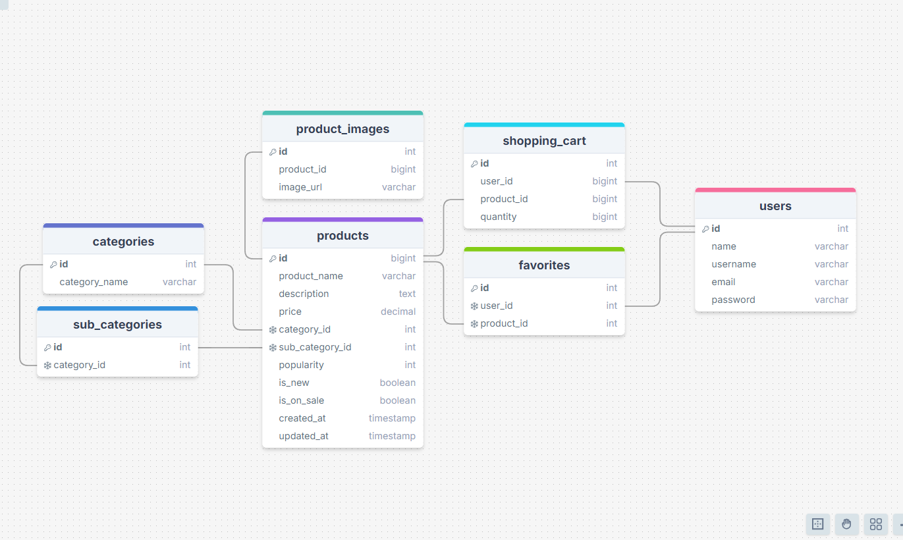

# Project Title

YouDress

## Overview

YouDress is a virtual fashion retail storefront that employs a 'dress up doll' feature so users can visually plan an outfit to purchase. Whether they're considering a new piece to go with their exisiting collection or buying a whole new outfit, their customized doll will alow them to unleash their creativity and consider various styling options. This is a fun way for users to filter out products to find and purchase new wardrobe pieces.

### Problem

When purchasing clothing online, the only way to visually conceptualize your future outfit is to consider the model in product photos and the list of clothing items in your shopping cart. Rather than having to put the outfit together once the user's pieces arrive in the mail, YouDress encourages the user to conceptualize how these pieces would fit together in a new or existing wardrobe before ordering.
YouDress attempts to bring the physical "try-on" experience found in a physical retailer, to a digital storefront, albeit in a more stylized and abstract way.

### User Profile

Online Shoppers (Women's Fashion // Young Adult Focus)

- Women ages 25-34 (highest preference for online shopping, potential nostalgia for early internet era dress up games)
- Women ages 18-25 (likely to be mobile users)
- Middle to upper class
- Likely use either Snapchat/Instagram/Twitter/Pinterest for fashion information

### Features


1. Dress up doll Widget

   - Provide base customizable dress up doll avatar widget, that can be toggled/hidden so as to allow user to focus on selecting items for purchase
   - Provide category-specific layered outfit item SVG's on a dress up doll model that are put on/swapped/re-coloured/taken off by user inputs, which in-turn filter clothing items/products
   - Dress up doll should persist from page to page and outfit information stored so user does not lose their outfit by navigating the website

2. Products Filter

   - User may filter products by using dress up doll, or by manually selecting sidebar product filters i.e. dresses + maxi + yellow + under $15

3. Products Display

   - Sorting feature so users may sort products by popularity/newness/price high to low/price low to high
   - Buttons on each product card allow users to instantly add to cart, favourite, and put item-type on dress up doll
   - Clicking product should bring up module/page of extra product information, as well as display add to cart & favourite buttons.

4. Page Navigation & Search Feature

   - Nav bar will have logo link to homepage
   - New button will link to New Products Page
   - Sale button will link to Sale Products Page
   - Categories page will link to Categories Page
   - Heart Icon will link to user Favourites Page
   - user icon will link to either
   - logged in profile
   - option to sign up/log in
   - search button will expand and allow user to search product tags
   - shopping cart icon will link Shopping Cart Page

5. Pages

   - New/Sale/Category will filter products
   - Favourites will filter saved products
   - Shopping Cart will filter shopping cart purchases

## Implementation

### Tech Stack

- React
- MySQL
- MySQL Workbench
- Express
- Client libraries:
  - react
  - react-router
  - axios
    -modulo (pop up item info?)
- Server libraries:
  - knex
  - express
  - bcrypt for password hashing

### APIs

- Need to locate fashion retail API to populate site with products and check that filter system is viable
- Alternatively use ChatGPT + Mocky to get exact qualities I want from each fashion item (i.e. category/type/color/price/sizes)
- This will be a temporary measure, before building my own server

### Sitemap

- Home Page (filterable products)
- New Products Page (filterable products)
- Sale Products Page (filterable products)
- Categories Pages (filter item type)
- Favourites Page (filter user favorited items)
- Shopping Cart Page (filter user items added to cart)
- Register Page
- Login Page
- User Profile Page

### Mockups

See first image in features for New Page + Filtered Dress/Short items

- [ ] Must add mockup of mobile/tablet/desktop of new Products page
  - visually same as sale/home products page
- [ ] Must add mockup of mobile/tablet/desktop of categories page
- [ ] Must add mockup of mobile/tablet/desktop of favourites page
- [ ] Must add mockup of mobile/tablet/desktop of shopping cart page
- [ ] Must add mockup of mobile/tablet/desktop of register page
- [ ] Must add mockup of mobile/tablet/desktop of login page
- [ ] Must add mockup of mobile/tablet/desktop of user profile page

### Data



### Endpoints

List endpoints that your server will implement, including HTTP methods, parameters, and example responses.

**GET /products **

- Get all products

Parameters:

- none

```
{
        "product_id": 1,
        "name": "Yellow Maxi Dress",
        "description": "A beautiful yellow maxi dress",
        "price": 19.99,
        "color": "Yellow",
        "category": "Dresses",
        "sub_category": "Maxi Dresses",
        "popularity": 10,
        "is_new": true,
        "is_on_sale": false,
        "image_url": "public/images/image.png"
}
```

**\*GET /products/filter **

- Get filtered products

Parameters(optional/combined):

- price_min
- price_max
- color
- category
- sub_category
- popularity
- is_new
- is_on_sale

```
{
        "product_id": 2,
        "name": "Green Sneakers",
        "description": "They're sneakers and they're green.",
        "price": 60.00,
        "color": "Green",
        "category": "Shoes",
        "sub_category": "Sneakers",
        "popularity": 2,
        "is_new": false,
        "is_on_sale": true,
        "image_url": "public/images/image.png"
}
```

**\*GET /products/{products_id} **

- Get single product

Parameters:

- product_id

```
{
        "product_id": 3,
        "name": "Grey Cargo Shorts",
        "description": "Let them know you mean business-casual.",
        "price": 19.99,
        "color": "Grey",
        "category": "Bottoms",
        "sub_category": "Shorts",
        "popularity": 5,
        "is_new": false,
        "is_on_sale": true,
        "image_url": "public/images/image.png"
}
```

**\*GET /users/{user_id}/favorites **

- get user's favorites

Parameters:

- user_id

```
    {
        "product_id": 1,
        "name": "Yellow Maxi Dress",
        "description": "A beautiful yellow maxi dress",
        "price": 19.99,
        "color": "Yellow",
        "category": "Dresses",
        "sub_category": "Maxi Dresses",
        "popularity": 100,
        "is_new": true,
        "is_on_sale": false,
        "image_url": "path/to/image.jpg"
    }
```

**\*POST /users/{user_id}/favorites **

- add product to user favourites

Parameters:

- user_id

```
{
        "product_id": 2
}
```

**\*DELETE /users/{user_id}/favorites/{product_id} **

- delete product from user's favourites

Parameters:

- user_id
- product \_id

```
{
        n/a
}
```

**\*GET /users/{user_id}/cart **

- get user's shopping cart

Parameters:

- user_id

```
{
        "product_id": 1,
        "name": "Yellow Maxi Dress",
        "description": "A beautiful yellow maxi dress",
        "price": 19.99,
        "color": "Yellow",
        "category": "Dresses",
        "sub_category": "Maxi Dresses",
        "popularity": 100,
        "is_new": true,
        "is_on_sale": false,
        "quantity": 2,
        "image_url": "path/to/image.jpg"
    }
```

**\*POST /users/{user_id}/cart **

- get user's shopping cart

Parameters:

- user_id

```
{

        "product_id": 1,

    }
```

**\*PUT /users/{user_id}/cart/{product_id} **

- edit quantity of product in user's shopping cart

Parameters:

- user_id
- product_id

```
{
        "product_id": 1,
        "quantity": 500,
    }
```

**\*DELETE /users/{user_id}/cart/{product_id} **

- delete product in user's shopping cart

Parameters:

- user_id
- product_id

```
{
        n/a
    }
```

**POST /users/register**

- Add a user account

Parameters:

- name: User's name
- email: User's email
- password: User's provided password

Response:

```
{
    "token": "seyJhbGciOiJIUzI1NiIsInR5cCI6IkpXVCJ9.eyJzdWIiOiIxMjM0NTY3ODkwIiwibmFtZSI6I..."
}
```

**POST /users/login**

- Login a user

Parameters:

- email: User's email
- password: User's provided password

Response:

```
{
    "token": "seyJhbGciOiJIUzI1NiIsInR5cCI6IkpXVCJ9.eyJzdWIiOiIxMjM0NTY3ODkwIiwibmFtZSI6I..."
}
```

**GET /users/profile**

- user profile page (links to favourites and shopping cart)

Parameters:

- name: User's name
- email: User's email

Response:

```
{
    "name": "user"
    "email" : "email@email.com"
}
```

### Auth

- JWT auth
  - Before adding auth, all API requests will be using a fake user with id 1
  - Added after core features have first been implemented
  - Store JWT in localStorage, remove when a user logs out

## Roadmap

SPRINT 1 - BUILD OUT PAGES VISUALLY - IMPLEMENT API DATA (exisiting or mocky) -filters are NOT necessarily functional, products are placeholder images - BUILD OUT DRESSUP WIDGET//AVATAR BASE WITH SWAPPABLE HAIRS & FACES (minimum 2 each) AND IMPLEMENT FUNCTIONALITY (click left/right arrows to cycle through faces and hairs) - CREATE OUTFIT SVG ASSETS (2 dress (short/long), 3 top (tank, tshirt, long sleeve), 3 bottom (short/capris/pants), 3 shoe (sneaker/boot/flats), 2 outerwear (sweater/jacket)) AND IMPLEMENT FILTER-AS-SVG-SELECTION

SPRINT 2 - BUILD SERVER to POPULATE APP WITH PRODUCTS WITH IDS AND FILTERABLE ATTRIBUTES - IMPLEMENT NAVIGATION OF SAVED ITEMS/SHOPPING CART/FILTERING OF PRODUCTS BY COLOR/PRICE/TYPE/NEW/SALE

SPRINT 3 - IMPLEMENT REGISTER/LOG-IN/JWT TOKENS - FIX ISSUES WITH STYLING - FIX ISSUES WITH FILTERING - FIX ISSUES WITH ROUTING - FIX ISSUES WITH AXIOS CALLS

## Nice-to-haves

- Dress up doll outfits saved to user profile

## Maybe-To-Get-Rid-Ofs

- Popularity filter
- Categories Page
- Shopping Cart OR favourites (pick one)
- MVP user is already logged in for demo -- no actual log-in functionality
